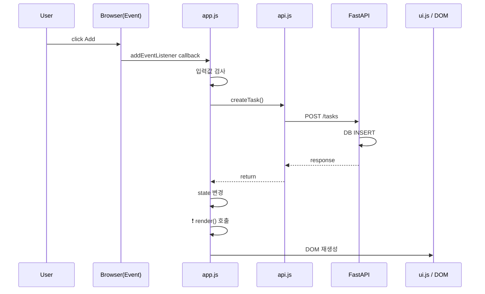
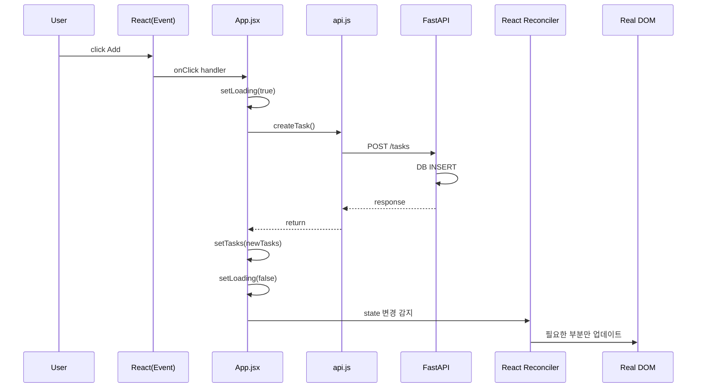

# Vanilla JS vs React – Sequence Diagram 비교

이 문서는 **같은 사용자 행동(할 일 추가)** 을 기준으로
- 기존 **Vanilla JS 구조**
- **React 구조**
의 차이를 **시퀀스 다이어그램**으로 비교 설명합니다.

---

## 공통 시나리오
사용자가 **Add 버튼을 눌러 Task를 추가**한다.

---

## 1. Vanilla JS 구조 (명령형, 수동 렌더링)



### 특징
- **명령형 흐름**: 개발자가 단계별로 직접 호출
- `render()` 호출을 **개발자가 책임**
- 상태 변경과 UI 변경이 **느슨하게 연결**

### 핵심 문제
- `render()` 호출 누락 시 UI 불일치
- 상태 변경 순서 실수로 버그 발생

---

## 2. React 구조 (선언형, 자동 렌더링)



### 특징
- **선언형 흐름**: 상태만 변경하면 UI는 자동 반영
- `render()`가 **존재하지 않음**
- 상태(state)와 UI가 **강하게 결합**

### 핵심 장점
- UI 동기화 실수 원천 차단
- 변경된 컴포넌트만 업데이트

---

## 3. 구조적 차이 요약

### 렌더링 책임

| 항목 | Vanilla JS | React |
|---|---|---|
| UI 갱신 책임 | 개발자 | 프레임워크 |
| render 호출 | 수동 | 자동 |
| 실수 가능성 | 높음 | 낮음 |

### 상태 → UI 흐름

**Vanilla**
```
state 변경
  ↓
render() 호출 필요
  ↓
UI 변경
```

**React**
```
state 변경
  ↓
UI 자동 변경
```

---

## 4. 한 문장 결론

> **Vanilla JS는 ‘UI를 어떻게 갱신할지’를 개발자가 관리하고,
> React는 ‘상태만 정의하면 UI 갱신을 자동화’한다.**

이 차이는 앱 규모가 커질수록 결정적으로 커진다.

